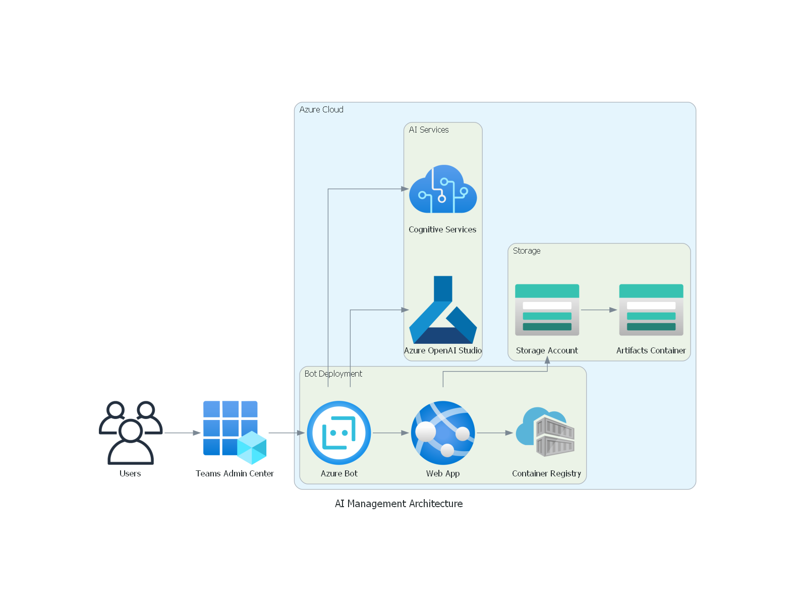

�# Invillia Bot Copilot Template
 
### How to Use This Template
 
To create a new project based on this template, click the "Use this template" button above and follow the instructions to set up your repository.
 
### Additional Information
 
For detailed instructions on how to set up and run the project, please refer to the individual `README.md` files listed in the glossary above. Each file provides specific guidance on the different components of the project.
 
### Introduction
 
This project, Invillia Template Bot LLM, is designed to enhance team collaboration and management through the integration of AI technologies.
 
### Architecture
 
Below is the architecture diagram of the AI Management Bot, showcasing the components and their interactions within the Azure cloud environment:
 

 
- **Users**: End users interacting with the bot through Microsoft Teams.
- **Teams Admin Center**: Where the bot is registered and managed.
- **Azure Cloud**:
  - **AI Services**:
    - **Azure OpenAI Studio**: Manages AI model training and deployment.
  - **Storage**:
    - **Storage Account**: Houses various data used by the bot.
    - **Artifacts Container**: Stores AI-related artifacts such as FAISS databases.
  - **Bot Deployment**:
    - **Azure Bot**: Hosts the bot service.
    - **Container Registry**: Manages the containerized deployment of the bot.
    - **Web App**: The bot's web interface hosted on Azure App Services.
 
- **FAISS Database**:
  - Instead of using Azure Cognitive Services, this project leverages FAISS (Facebook AI Similarity Search) databases for vector-based retrieval. The FAISS databases are created locally within the `artifacts` directory. Each tenant in the multi-tenant RAG architecture has a separate FAISS database, ensuring data isolation and tailored responses based on the specific tenant's data.
 
### Project Structure Overview
 
The project is organized to provide a clear separation of concerns, making it easy to navigate and extend. Below is an overview of the project structure, including components outside of the `src` folder.
 
#### Root Directory Overview
 
- **docker-compose.yml**
  - This file is used to define and manage multi-container Docker applications. It specifies the services, networks, and volumes needed to run the application. It is especially useful for deploying the bot and its dependencies in a containerized environment.
 
- **Dockerfile**
  - A script that contains the instructions to build a Docker image for the application. This file is crucial for deploying the bot in a consistent environment, ensuring that all dependencies and configurations are correctly applied.
 
- **images/**
  - Directory containing visual assets related to the project.
  - **architecture.png**: The architecture diagram of the AI Management Bot.
 
- **README.md**
  - The documentation file you are currently reading. It provides an overview of the project, instructions for setting up and running the application, and information about the project's structure and components.
 
- **Makefile**
  - A file containing a set of directives used by the `make` build automation tool to automate tasks such as setting up the environment, running tests, or deploying the application. It simplifies project management tasks by providing a standardized interface for running commands.
 
- **requirements.txt**
  - A file that lists all the Python dependencies required for the application. It is used by `pip` to install the necessary packages to run the bot.
 
- **requirements-dev.txt**
  - A file that lists additional Python dependencies needed for development purposes, such as testing and debugging tools. This ensures that development environments have all the necessary tools installed.
 
- **setup.py**
  - The setup script used to package and install the project as a Python package. This file defines the package metadata, dependencies, and any scripts or entry points required by the application.
 
#### `src/` Directory Overview
 
The `src/` directory contains the core application logic, including the bot implementation, service integrations, and configuration files. Here's a breakdown of its structure:
 
- **appManifest/**
  - Contains files related to the Microsoft Teams app manifest, including icons and the `manifest.json` file that defines how the bot will appear and behave in Teams.
 
- **app.py**
  - The main entry point for the Python application. This script sets up the bot and starts the server to listen for incoming messages from Microsoft Teams.
 
- **artifacts/**
  - Directory for storing AI model artifacts and related data. This may include pre-trained models, embeddings, or other resources necessary for the bot's operation.
 
- **botcopilot/**
  - The core module containing all functional components of the application:
    - **bots/**: Implements the AI bot logic.
    - **clients/**: Contains service client implementations (e.g., for Azure Storage, Microsoft Graph API).
    - **configurations/**: Manages application configuration settings.
    - **retrievers/**: Handles the retrieval of information from vector embeddings.
    - **services/**: Provides various services used throughout the application (e.g., OpenAI integration, caching).
 
- **prompts/**
  - Contains text files with various prompts used by the bot, such as the initial system prompt and welcome messages.
 
### Glossary of README Files
 
This project contains several `README.md` files across different directories, each providing detailed information about the components they document. Below is a glossary of these files with links to each:
 
- **[src/appManifest/README.md](src/appManifest/README.md)**
  - Provides an overview of the app manifest, its role in the Teams bot deployment process, and includes references to Microsoft documentation and bot templates.
 
- **[src/artifacts/README.md](src/artifacts/README.md)**
  - Explains the purpose of the artifacts stored in the `artifacts` directory, detailing the FAISS database files used for retrieval in the AI assistant's RAG architecture.
 
- **[src/botcopilot/README.md](src/botcopilot/README.md)**
  - Describes the `botcopilot` library, which abstracts the features needed for a Q&A AI assistant using the RAG architecture and LangChain framework.
 
- **[src/prompts/README.md](src/prompts/README.md)**
  - Discusses the importance of the `system_prompt` and `welcome_message` files, which define the AI assistant's role and the first message the user receives.
